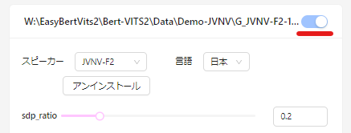

# EasyBertVits2

I haven't tested it in an English environment, but if you have an English model it should work the same way. Maybe.<br>我没有在中文环境中测试过，但是如果你准备一个中文模型，它应该以同样的方式工作。也许吧。

文章から感情豊かな音声を生成する [Bert-VITS2](https://github.com/fishaudio/Bert-VITS2) を簡単に使えます。<br>主に litagin さんの  [Bert-VITS2 (ver 2.1, 2.2) の学習方法（2023-12-01）](https://zenn.dev/litagin/articles/b1ddc1da5ea2b3)を自動化したものです。

サンプル音声は[こちら](https://twitter.com/Zuntan03/status/1735947687466557733)。

### 2023/12/17

- litagin さんの [bert_vits2_okiba](https://huggingface.co/litagin/bert_vits2_okiba) から 27種のモデル (18.1GB) をダウンロードする `Download-litagin-bert_vits2_okiba.bat` を追加しました。
	- [Install-EasyBertVits2.bat](https://github.com/Zuntan03/EasyBertVits2/releases/download/v2.1.1/Install-EasyBertVits2.bat) を再ダウンロードして、インストール先の `Install-EasyBertVits2.bat` に上書きして再実行で更新できます。

## インストールと音声の生成

最近のNVIDIA製ビデオカード（VRAM 8GB以上）を搭載した、管理者権限のある Windows PC で動作します。 
Git や Python は不要です。 
アバストなどのウィルスチェックソフトが有効だと、インストールに失敗する場合があるようです。

Pythonにパスが通っていない状態で外付ドライブにインストールしようとすると、以下のエラーが発生します。 
内蔵ドライブにインストールするか、Python 3.10系をインストールしてパスを通すかで対処してください。

```
OSError: [WinError 1] ファンクションが間違っています。: '～\\python310.dll'
'～\activate.bat' is not recognized as an internal or external command, operabale program or batch file.
Press any key to continue . . .
```

1. [Releases](https://github.com/Zuntan03/EasyBertVits2/releases) から [Install-EasyBertVits2.bat](https://github.com/Zuntan03/EasyBertVits2/releases/download/v2.1.1/Install-EasyBertVits2.bat)（←を右クリックから保存も可） をダウンロードして、インストール先のフォルダ **（スペースを含まない英数字のみの浅いパス）** で実行します。
	- **「WindowsによってPCが保護されました」と表示されたら、「詳細表示」から「実行」します。**
	- ファイルの配布元を `Ctrl + Click` で確認して、問題がなければ `y` と `Enter` を入力してください。
2. インストールが終わると `Hiyori UI` が Web ブラウザに表示されますので、**ブラウザの翻訳機能で日本語化します**（例はChrome で右クリックから `日本語に翻訳`）。<br>
3. 右上の `モデルのロード` の下の欄をクリックして、[JVNV](https://sites.google.com/site/shinnosuketakamichi/research-topics/jvnv_corpus) の学習済みモデル `G_JVNV-F2-10000.pth` を選択します。<br>
	- `Download-DemoModel.bat` で学習ステップ数の異なるモデルを追加でダウンロードできます。<br>複数のモデルを選択して、生成された音声を聴き比べることもできます。
4. モデル選択欄の右側の `ZH` を **2 番めの `日本`** （選択後に `JP` に変わります）にして `モデルをロードする` をします。<br>
5. ロードされたモデルが画面下に表示されますので、**右上のトグルを有効にします** 。<br>
6. `テキストコンテンツを入力してください` に文章を入力して、`音声を生成する` で生成します。<br>
7. 音声は下部のモデル別に生成され、再生やダウンロードができます。複数のモデルで同時に生成して、聴き比べることもできます。<br>
	- 文章の内容で感情表現が大きく変化します。以下のサンプル文章で生成を試してみてください。
		- ずっとずっと好きでした! 私とお付き合いしてください。お願いします！
		- マッサージ、上手いねー。 あっ そうっ!  そこっ!  いい! いい～!!  あああぁぁ～～～～! 
		- ごめんなさい…本当に許してください…ごめんなさい…もうしませんkv
	- `感情` で `0-9` のスタイルを選べますが、動作がいまいち＆旧仕様になるので放置が良さそうです。
8. どこかから学習済みモデルを入手したのなら、`Bert-VITS2\Data` 以下にフォルダを作成して、`G_*.pth` のモデルと `config.json` の設定ファイルを一緒に置けば同様に読み込めます。
	- `Download-litagin-bert_vits2_okiba.bat` で [litagin さんの bert_vits2_okiba](https://huggingface.co/litagin/bert_vits2_okiba) からモデルをダウンロードできます。

`Hiyori UI` を再度立ち上げたい場合は、`HiyoriUi.bat` を実行します。

## 音声を学習してみる

音声の学習には感情豊かな読み上げ音声と、その文章が必要です。<br>ここではサンプルとして感情豊かな [JVNV](https://sites.google.com/site/shinnosuketakamichi/research-topics/jvnv_corpus) の音声と文章を学習してみます。

1. `Download-LearningSample-JVNV.bat` を実行すると、`Bert-VITS2\Data` に `JNNV-F2` プロジェクトを作成し、学習用のデータをダウンロードします。
	- `JNNV-F2` プロジェクトの `audios\raw` に、感情豊かな音声ファイルがありますので、学習用音声の参考にしてください。
	- `JNNV-F2` プロジェクトの `filelists\esd.list` で音声の読みとファイルパスを指定していますので、テキストエディタで開いて参考にしてください。
2. プロジェクトの `Learn.bat` で学習を開始します。<br>しばらく待つと学習結果が `models\G_*.pth` に書き出されますので、`HiyoriUi.bat` で読み込んで学習状況を確認できます。<br>ビデオカードの VRAM が 8GB の場合は、学習中の VRAM 不足を防ぐために `CPU` で読み込んでください。<br>

## 学習用の音声を長尺の音声ファイルから変換する

[litaginさんがツールを用意しています。](https://github.com/litagin02/slice-and-transcribe)

1. `CreateProject.bat` で `Bert-VITS2\Data` に学習用プロジェクトを作成します。
2. プロジェクトの `audios\raw` に音声を配置します。
3. プロジェクトの `filelists\esd.list` に音声ファイルパスと音声の読みを入力します。
4. プロジェクトの `Learn.bat` で学習します。

## 学習用の音声を収録する

`Download-LearningSample-JVNV.bat` を実行していれば、読み上げ収録ソフトの[OREMO](http://nwp8861.web.fc2.com/soft/oremo/index.html)（[ダウンロード](https://twitter.com/nwp8861/status/1694845767738167719)は[こちら](https://onedrive.live.com/?id=4E56C6D911E0FAA3%21326&cid=4E56C6D911E0FAA3)）で収録するためのファイルが `lib\JVNV-F2_Bert-VITS2-main\OREMO\` にあります。

- `JVNV_OREMO.txt` は OREMO で収録するための音名リストです。
	- JVNV のフレーズフリーセッションは、学習に必要なアドリブ部の読みテキストが無いため取り除いています。
- `JVNV_OREMO_rename.bat` は OREMO で収録した wav と同じフォルダに置いて実行すると、ファイル名を学習用に変更します。
- `filelists\esd.list` は `lib\JVNV-F2_Bert-VITS2-main\JVNV.txt` を置換で編集して用意します。
- 数が多い場合は、`lib\JVNV-F2_Bert-VITS2-main\transcription.pdf` の各感情が均等になるように収録するとよいかもしれません。
- 収録時の感情表現を大きくしたほうが、Bert-VITS2 の特性にあっているようです。

音声ファイルを用意したあとは『[学習用の音声を長尺の音声ファイルから変換する](#学習用の音声を長尺の音声ファイルから変換する)』と同じです。

## その他

- プロジェクトの `models\G_WebUi.bat` に、学習したモデルファイル `G_*.pth` をドラッグ＆ドロップすると、[Bert-VITS2](https://github.com/fishaudio/Bert-VITS2) の WebUI でモデルを試せます。
- プロジェクトの `models\G_Compress.bat` に、学習したモデルファイル `G_*.pth` をドラッグ＆ドロップすると、配布用の省サイズモデルに圧縮します。
	- 音声生成時に `ERROR:utils:enc_q … is not in the checkpoint` と表示されますが、音声の生成はできるようです。

## そのうち？

- Bert-VITS2 v2.2 対応
	- 手元では動いてはいるが、生成の品質が高められていない。
	- [litaginさんのStyle Textが便利](https://github.com/litagin02/Bert-VITS2-litagin)で、[待っていれば入りそう](https://github.com/fishaudio/Bert-VITS2/pull/240) で様子見。
	- [Bert-VITS2-UI](https://github.com/jiangyuxiaoxiao/Bert-VITS2-UI) の v2.2 対応版のリリースも待ちたい。
	- そうこうしてるうちに [v2.3](https://github.com/fishaudio/Bert-VITS2/tree/dev-2.3) が来たりするかも。

## 参照

- [Bert-VITS2 (ver 2.1, 2.2) の学習方法（2023-12-01）](https://zenn.dev/litagin/articles/b1ddc1da5ea2b3)
- [Bert-VITS2](https://github.com/fishaudio/Bert-VITS2)
- [Bert-VITS2-UI](https://github.com/jiangyuxiaoxiao/Bert-VITS2-UI)
- [bert-vits2_base_model-2.1](https://huggingface.co/Garydesu/bert-vits2_base_model-2.1)
- [JVNV](https://sites.google.com/site/shinnosuketakamichi/research-topics/jvnv_corpus)

## ライセンス

このリポジトリのスクリプトやドキュメントは、[MIT License](./LICENSE.txt)です。

This software is released under the MIT License, see [LICENSE.txt](./LICENSE.txt).
